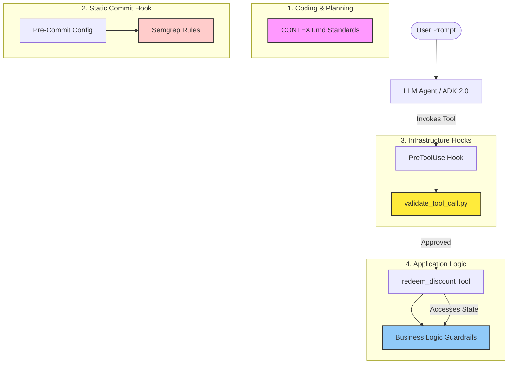

# 🔐 Secure Agentic Coding Lab: Hardening AI Agents against Runtime Risks

This repository contains the complete implementation and artifacts from the **[Secure Agentic Coding Codelab](https://codelabs.developers.google.com/secure-agentic-coding)**. It serves as a hands-on learning blueprint for security engineers and AI developers looking to understand the threat landscape of LLM-based agents and how to secure them.

---

## 🎯 Lab Purpose & Philosophy

Traditional application security focuses on securing APIs, databases, and authentication endpoints. However, **AI agents introduce a new class of runtime risks**: they dynamically select tools, execute commands, parse unstructured input, and make decisions semi-autonomously. 

This lab is designed to teach how to transition from traditional application security to **Agentic Security**, implementing a multi-layered defense-in-depth posture that spans static analysis, threat modeling, test-driven development (TDD), and runtime interception.

---

## 🎓 Key Learnings & Takeaways

### 1. Agentic Threat Modeling (STRIDE)
Instead of modeling simple data flows, this lab demonstrates how to apply the STRIDE framework specifically to ReAct agent architectures. This highlights unique agent vectors:
* **Spoofing & Elevation of Privilege**: How LLM instruction-following can be tricked into spoofing `user_id` values or bypassing basic string checks (e.g. prefix matches).
* **Tampering & TOCTOU**: Understanding race conditions (Time-of-Check to Time-of-Use) when agents manage volatile state across tool runs.
* Read the completed model in [threat_model.md](file:///C:/Users/danny/secure-agent-lab/shopping-assistant/threat_model.md).

### 2. Multi-Layer Defense-in-Depth
You'll learn how to build a robust safety net around the agent. The lab demonstrates security enforcement at four distinct boundaries:
1. **Developer Context Gate**: Grounding developer/coding agents (using [CONTEXT.md](file:///C:/Users/danny/secure-agent-lab/shopping-assistant/.agents/CONTEXT.md)) to enforce secure-by-default paradigms.
2. **Static Commit Gate**: Stopping credential leaks automatically via Semgrep and pre-commit hooks.
3. **Runtime Interception Hook**: Intercepting and validating tools *before* they are sent to the execution layer.
4. **Tool-Level Guardrails**: Writing robust Python logic with strict type checking and state isolation.



### 3. Static Analysis for LLM Secret Leakage
Hardcoded keys are a major vulnerability in AI development. In this lab, you'll learn to:
* Write custom [Semgrep rules](file:///C:/Users/danny/secure-agent-lab/shopping-assistant/.semgrep/rules.yaml) that target specific pattern matches for sensitive credentials (e.g., Google `AIzaSy...` keys).
* Integrate them into a local [pre-commit hook](file:///C:/Users/danny/secure-agent-lab/shopping-assistant/.pre-commit-config.yaml) to block insecure commits before they reach remote repositories.

### 4. Runtime Tool Interception (PreToolUse)
How do you prevent an agent from running harmful commands at runtime, even if it is tricked by prompt injection?
* Configure `PreToolUse` hooks in [hooks.json](file:///C:/Users/danny/secure-agent-lab/shopping-assistant/.agents/hooks.json).
* Build a command validator script [validate_tool_call.py](file:///C:/Users/danny/secure-agent-lab/shopping-assistant/.agents/scripts/validate_tool_call.py) that acts as an out-of-band firewall, parsing tool parameters (like shell commands) and blocking destructive executions (e.g., preventing arbitrary shell command execution).

### 5. TDD for Security Boundaries
Rather than verifying security manually, you'll learn to write a dedicated security test suite using `pytest` in [test_agent.py](file:///C:/Users/danny/secure-agent-lab/shopping-assistant/tests/test_agent.py). These tests assert:
* **Single-Use Enforcement**: Discount codes cannot be redeemed more than once.
* **Privilege Segregation**: Guest accounts (e.g., `guest_*`) are rejected.
* **Strict State Isolation**: Using Pytest fixtures to reset state between tests to guarantee zero test cross-contamination.

---

## 📁 Repository Structure & Educational Roles

Every file in this project represents an educational lesson in agentic safety:

| File / Directory | Concept / Takeaway | Description |
| :--- | :--- | :--- |
| [`app/agent.py`](file:///C:/Users/danny/secure-agent-lab/shopping-assistant/app/agent.py) | **Secure Tool Design** | Demonstrates robust parameter validation (rejects invalid codes, prevents guest access) alongside an *intentional simulated vulnerability* (hardcoded mock API key) to trigger security gates. |
| [`.agents/CONTEXT.md`](file:///C:/Users/danny/secure-agent-lab/shopping-assistant/.agents/CONTEXT.md) | **Developer Alignment** | Defines rules that developer/agent models must follow, ensuring secure coding paradigms are established from the outset. |
| [`.agents/hooks.json`](file:///C:/Users/danny/secure-agent-lab/shopping-assistant/.agents/hooks.json) | **Runtime Interception** | Configures infrastructure-level hooks to intercept tool usage before execution. |
| [`scripts/validate_tool_call.py`](file:///C:/Users/danny/secure-agent-lab/shopping-assistant/.agents/scripts/validate_tool_call.py) | **Security Firewalls** | Python script executing out-of-band logic to inspect and block destructive tools. |
| [`.semgrep/rules.yaml`](file:///C:/Users/danny/secure-agent-lab/shopping-assistant/.semgrep/rules.yaml) | **Static Scanning** | Custom rule patterns targeting Google API Studio credential signatures. |
| [`.pre-commit-config.yaml`](file:///C:/Users/danny/secure-agent-lab/shopping-assistant/.pre-commit-config.yaml) | **Git Hooks** | Automates the local Semgrep scan, preventing vulnerabilities from leaking to version control. |
| [`tests/test_agent.py`](file:///C:/Users/danny/secure-agent-lab/shopping-assistant/tests/test_agent.py) | **TDD & Assertions** | Pytest security test suite asserting on authorization and single-use business constraints. |
| [`threat_model.md`](file:///C:/Users/danny/secure-agent-lab/shopping-assistant/threat_model.md) | **STRIDE Framework** | Full STRIDE analysis documenting agent threat vectors and their respective mitigations. |

---

## 🏗️ Step-by-Step Lab Architecture

### 1. Project Scaffolding & Setup
* Scaffolded an ADK 2.0 ReAct agent project using `uvx google-agents-cli`.
* Configured `pyproject.toml` and verified virtual environment configuration via `uv`.

### 2. Custom Semgrep Rules & Git Hook Automation
* Defined a rule to scan for credentials matching `AIzaSy[A-Za-z0-9_\-]*`.
* Added the pre-commit configuration.
* **Demonstration**: When a developer attempts to commit `agent.py` containing the mock key, the commit is blocked by the Git hook:
  ```bash
  git commit -m "feat: add API key"
  # Semgrep Scan...........................................................Failed
  # - hook id: semgrep-local
  # - exit code: 1
  # Security violation: Hardcoded Google API key detected.
  ```

### 3. Tool Verification & TDD
* Formulated security boundary tests first.
* Implemented the `redeem_discount` tool.
* Ran and passed the security test suite:
  ```bash
  uv run pytest tests/test_agent.py
  # ======================== 3 passed in 3.57s ========================
  ```

### 4. Running the Dev Playground
* Started the ADK dev server to inspect the agent graph and tools visually:
  ```bash
  uv run adk web app --host 127.0.0.1 --port 8080
  ```

---

## 🔑 Key Technical Notes & Gotchas

| Problem | Root Cause | Fix Applied |
| :--- | :--- | :--- |
| `uv sync` fails on Windows | OneDrive filesystem blocks hardlinks | `$env:UV_LINK_MODE="copy"` |
| `Edge.chain(...)` AttributeError | Method doesn't exist in ADK 2.0 | Replaced with `edges=[("START", agent)]` tuple notation |
| `SessionNotFoundError` in dev server | `App(name="shopping_assistant")` mismatches folder name `app` | Changed to `App(name="app")` |
| Pre-commit hook not finding Semgrep | Hook runs from repo root, one level above the project | Used `uv run --directory shopping-assistant semgrep` |
| `agents-cli playground` fails | CLI globs current directory contents into `adk web` args | Use `uv run adk web app` directly instead |
| API key `api_key=` not a `Gemini` field | ADK 2.0 `Gemini` class dropped `api_key` from its schema | The `# type: ignore` suppresses the Pydantic validation warning for the codelab demo |

---

## 🚀 Running It Yourself

### Prerequisites
* Python 3.11–3.13
* [`uv`](https://docs.astral.sh/uv/)
* `uvx google-agents-cli`
* A real `GEMINI_API_KEY` from [Google AI Studio](https://aistudio.google.com/app/apikey)

### Clone & Build
```bash
git clone https://github.com/xylaes/secure-agent-lab.git
cd secure-agent-lab/shopping-assistant
$env:UV_LINK_MODE="copy"
uv sync
```

### Run Security Verification Tests
```bash
uv run pytest tests/test_agent.py
```

### Try Tracing on the Dev Server
```bash
uv run adk web app --host 127.0.0.1 --port 8080
# Access: http://127.0.0.1:8080/dev-ui/?app=app
```

---

## 📚 References
* [Google Secure Agentic Coding Codelab](https://codelabs.developers.google.com/secure-agentic-coding)
* [Google Agent Development Kit (ADK)](https://adk.dev/)
* [Semgrep Documentation](https://semgrep.dev/)
* [STRIDE Threat Modeling Guidance](https://learn.microsoft.com/en-us/azure/security/develop/threat-modeling-tool-threats)
